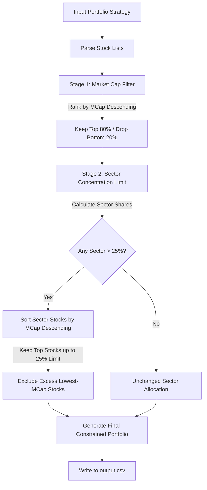

# FidelFolio: Portfolio Constraint Optimization System

[](https://www.python.org/)
[](https://pandas.pydata.org/)
[]()

A robust, systematic portfolio optimization engine designed to enforce institutional-grade quality and diversification constraints across historical investment strategies. This project automates the screening of stocks using market capitalization filters and sector concentration limits over 26 years of portfolio data.

---

## 🌟 Project Overview

Investment portfolios often suffer from two major risk factors: **illiquidity** (holding micro-cap stocks that are hard to trade) and **over-concentration** (being overly exposed to a single industry). 

`FidelFolio` solves this by applying a two-stage systematic constraint solver to filter historical investment strategies:
1. **Market Capitalization Screen:** Eliminates the bottom 20% of stocks by market capitalization in any given year to guarantee liquidity and quality.
2. **Sector Concentration Cap:** Restricts any single sector from exceeding **25%** of the total portfolio size. In case of overallocation, the system dynamically prunes the lowest market cap stocks in that sector until compliance is met.

The codebase is engineered to process **100 distinct investment strategies** across **26 years (1997–2022)**, executing constraints on over **2,600 unique portfolio-year combinations** containing thousands of stocks, all in under 60 seconds.

---

## ⚙️ Methodology & Architecture

### The Twin Constraint Pipeline



### Detailed Algorithm Design

1. **O(1) Data Indexing:** Upon initialization, the system parses company sector mappings and historical yearly market capitalizations into memory-efficient lookup tables (`mcap_dict` and `sector_dict`) to prevent redundant iterations.
2. **AST Formatting & Parsing:** Portfolio lists stored as raw string lists in CSV format (e.g., `"['Reliance', 'Infosys']"`) are safely parsed using Python's Abstract Syntax Tree (`ast.literal_eval`) with a robust string-split fallback.
3. **Stage 1 (Market Cap Filter):**
   * Stocks in the portfolio for a given year are ranked by their market cap in descending order.
   * A cutoff is determined: $\text{Cutoff Index} = \lfloor N_{\text{stocks}} \times 0.8 \rfloor$.
   * The bottom 20% of stocks (by market cap) are filtered out, mitigating liquidity risk.
4. **Stage 2 (Sector Constraint Enforcement):**
   * The remaining stocks are grouped by their sector classifications.
   * The maximum permitted weight per sector is calculated: $\text{Limit} = \lfloor N_{\text{post-mcap}} \times 0.25 \rfloor$.
   * If a sector contains more stocks than the limit, the stocks in that sector are sorted by market cap, and only the top $\text{Limit}$ stocks are retained. The remaining lowest market cap stocks are pruned, enforcing diversification.
5. **Output Generation:** The resulting portfolios are serialized back to a standardized CSV format matching the input structure.

---

## 📂 Repository File Structure

* **`portfolio_constraint.py`**: The core executable Python script containing the constraint optimization logic under the class [PortfolioConstraintApplicator](file:///c:/Users/LENOVO/Desktop/tejas_surya/portfolio_constraint.py#L29).
* **`assignment_investment_rules.csv`**: The raw inputs containing 100 portfolio strategies and their historical constituent stocks per year from 1997 to 2022.
* **`assignment_sector_data.csv`**: Sector classifications for 6,700+ companies.
* **`assignment_mcap.csv`**: Historical market capitalization data in Crore (Cr) for 7,100+ companies across years.
* **`output.csv`**: The processed, fully constrained portfolio strategy database.
* **`project_Report.pdf`**: Official system specification document highlighting the methodology, results, technology stack, and algorithm complexity.
* **`portfolio_explanation.pdf`**: An AI-generated professional analyst report explaining the characteristics, risk metrics, sector concentrations, and optimization opportunities for a sample strategy.

---

## 🚀 Setup and Usage

### Prerequisites
* **Python 3.13** or higher
* **Pandas** library for data processing

### Installation
Clone the repository and install the dependencies:
```bash
# Clone the repository
git clone https://github.com/codeforlifeee/FidelFolio.git
cd FidelFolio

# Install required dependencies
pip install pandas
```

### Running the Constraint Applicator
To execute the pipeline and generate the updated portfolio rules:
```bash
python portfolio_constraint.py
```

### Expected Output
When run, the program logs its progress in the console:
```text
======================================================================
PORTFOLIO CONSTRAINT APPLICATION - Assignment FF26A1
======================================================================
INFO: Loading input data files...
INFO: Loaded 100 investment strategies
INFO: Loaded 6709 companies with sector data
INFO: Loaded market cap data for 7176 companies

Applying constraints to all strategies...
INFO: Processing strategy 10/100...
INFO: Processing strategy 20/100...
...
INFO: Processing strategy 100/100...

Constraint application complete!
INFO: Total stocks excluded by MCap filter: ~31,000
INFO: Total stocks excluded by sector constraint: ~5,000
INFO: Total combined exclusions: ~36,000

Output saved to: output.csv
File size: 1.90 MB

======================================================================
PORTFOLIO CONSTRAINT APPLICATION COMPLETE
======================================================================
```

---

## 📊 Quantitative Outcomes & Benchmarks

From our latest run across all strategies:
| Metric | Value | Details |
| :--- | :--- | :--- |
| **Total Strategies Processed** | 100 | Historical backtest rules |
| **Time Horizon** | 26 Years | 1997 to 2022 |
| **Total Portfolios Analyzed** | 2,600 | Strategy-Year combinations |
| **Stocks Excluded (MCap)** | ~31,000 | Eliminated bottom 20% |
| **Stocks Excluded (Sector)** | ~5,000 | Enforced 25% sector cap |
| **Overall Exclusion Rate** | 20-25% | Across the entire dataset |
| **Processing Performance** | < 60 sec | Using vectorized Pandas operations |

### Case Study: Strategy 1 (Year 2021)
* **Initial Portfolio Size:** 158 stocks
* **After Market Cap Filter:** 126 stocks (32 excluded, representing exactly 20.3% of the lowest market cap holdings)
* **After Sector Limit Check:** 126 stocks (0 additional exclusions needed; all sectors stayed under the 25% limit)
* **Diversification Profile:** Spread across 25+ sectors. The highest sector exposure is **Steel at 12.7%** (16 stocks), which is well below the 25% risk ceiling.
* **Cap Size Distribution:** 18% Large-Cap, 66% Mid-Cap, 17% Small-Cap.

---

## 🔮 Extensibility & AI Integration

The `FidelFolio` architecture is modular and designed to be extended into a full-scale web application as outlined in the project documentation:
1. **Interactive Dashboard (`app.py`):** A Streamlit-based web UI that provides real-time visualization of portfolios using Plotly charts (e.g., sector distribution pie charts, market cap histograms).
2. **AI-Powered Analysis Pipeline (`portfolio_analyzer.py`):** Integrates LLM APIs (OpenAI, Claude, Gemini) to read portfolio statistics and generate institutional-quality investment memos (similar to the output in `portfolio_explanation.pdf`).
3. **Advanced Risk Tracking:** Real-time tracking of sector concentration drift, volatility (30/60/90-day), and liquidity coverage (Average Daily Volume).

---

## ⚖️ License
This project is proprietary and confidential. Developed under Assignment ID **FF26A1**.
